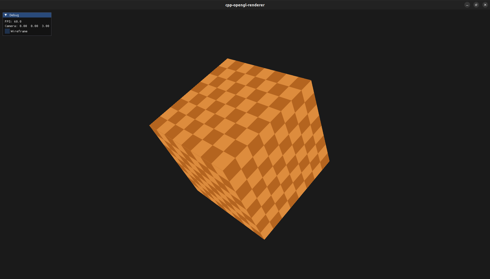
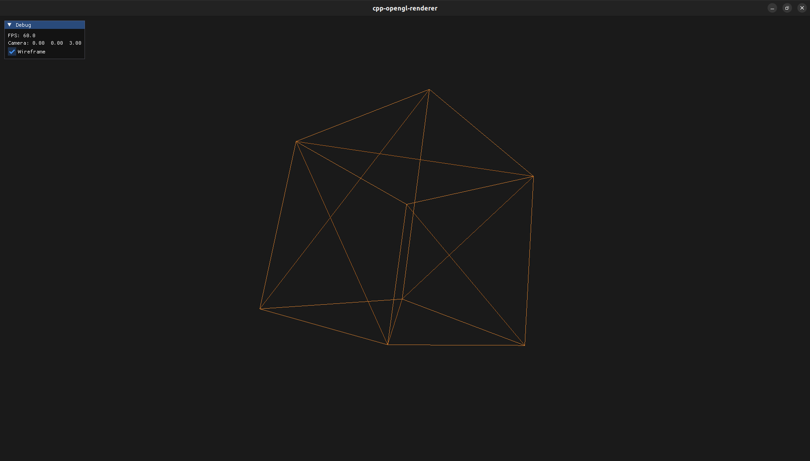

# cpp-opengl-renderer

A real-time 3D renderer written in C++20 and OpenGL 3.3 Core Profile. The goal
was a clean, self-contained codebase that demonstrates the full graphics pipeline
— geometry upload, shader compilation, texture loading, camera math, and an
immediate-mode GUI overlay — without relying on a game engine or framework.

| Solid | Wireframe |
|-------|-----------|
|  |  |

---

## Features

- Textured rotating cube, UV-mapped per-face with a correct bottom-left OpenGL UV origin
- FPS-style free-look camera (WASD + mouse, Euler yaw/pitch, pitch clamped to ±89°)
- Dear ImGui overlay: live FPS counter, world-space camera XYZ, wireframe toggle
- Wireframe mode switches between `GL_FILL` and `GL_LINE` within the same frame
- Frame-rate-independent motion throughout — all movement and rotation scaled by delta time
- Graceful error reporting on missing assets: `std::runtime_error` with a clear message, caught in `main()`
- Viewport and projection matrix update automatically on window resize

---

## Building

**Requirements:** GCC 11+ or Clang 13+, CMake 3.20+, OpenGL 3.3 driver, Python 3 (used by GLAD2 at configure time to generate the loader).  
No other system packages needed — all dependencies are fetched automatically.

```bash
git clone <repo-url> cpp-opengl-renderer
cd cpp-opengl-renderer
cmake -B build -DCMAKE_BUILD_TYPE=Debug
cmake --build build --parallel
./build/cpp-opengl-renderer
```

For a release build (strips `GL_CHECK` overhead):

```bash
cmake -B build -DCMAKE_BUILD_TYPE=Release
cmake --build build --parallel
./build/cpp-opengl-renderer
```

---

## Controls

| Input | Action |
|-------|--------|
| `W` `A` `S` `D` | Move camera forward / left / backward / right |
| Mouse | Look around |
| `Escape` | Toggle mouse capture on/off |
| Mouse over overlay | Suspends look control so you can interact with the panel |
| Window close / `Alt+F4` | Exit |

---

## Architecture

The source tree is split into three layers with no circular dependencies:

```
src/
├── core/         Window (GLFW context lifecycle), Application (main loop)
├── renderer/     GPU resource wrappers — Shader, Texture, VertexBuffer,
│                 VertexArray, IndexBuffer, Renderer
└── camera/       FPS Camera — view/projection matrices, keyboard/mouse input
```

`Application` owns all subsystems and drives the per-frame update/render cycle.
Each subsystem class has a single stated responsibility and is independently
readable without knowing the others.

### OpenGL resource management

Every GPU resource (program, buffer, texture, VAO) is wrapped in a class that
acquires in the constructor and releases in the destructor. No raw `GLuint`
handles leak into application code. Objects are non-copyable.

```cpp
// VertexBuffer acquires on construction, releases on destruction
VertexBuffer vbo(std::span<const float>{vertices});
```

`std::span<const float>` is used for buffer data views throughout — no raw
pointer + size pairs.

### Error checking

A `GL_CHECK(call)` macro wraps every OpenGL call in debug builds. On any
non-`GL_NO_ERROR` result it prints the error code, source file, and line number
to `stderr`, then calls `std::abort()`. In release builds (`-DNDEBUG`) the
macro expands to a direct call with no overhead.

```cpp
GL_CHECK(glDrawElements(GL_TRIANGLES, ibo.getCount(), GL_UNSIGNED_INT, nullptr));
```

### Dependency management

All five external dependencies are fetched at CMake configure time via
`FetchContent`. No submodules, no package manager, no pre-installed libraries
beyond the compiler and OpenGL driver.

| Library | Version | Role |
|---------|---------|------|
| GLFW | 3.4 | Window and input |
| GLAD2 | 2.0.4 | OpenGL 3.3 Core loader (generated at configure time) |
| GLM | 1.0.1 | Vector and matrix math |
| Dear ImGui | 1.91.6-docking | Immediate-mode GUI overlay |
| stb_image | pinned commit | JPEG/PNG texture loading |

CMake integration uses only target-scoped commands (`target_include_directories`,
`target_link_libraries`). There are no directory-scoped `include_directories` or
`link_libraries` calls.

### Cube geometry

The cube uses 24 vertices (4 per face) rather than 8 shared vertices, because
each face needs independent UV coordinates. An index buffer (36 indices) avoids
redundant vertex data. Vertex layout is 5 floats per vertex, 20-byte stride:

```
attribute 0 — vec3 position  (offset  0)
attribute 1 — vec2 texCoord  (offset 12)
```

### Camera math

The FPS camera accumulates mouse deltas as yaw and pitch (Euler angles), clamps
pitch to ±89° to prevent gimbal flip, and derives the look, right, and up vectors
each frame. The view matrix is computed with `glm::lookAt`; projection with
`glm::perspective`. All movement is scaled by elapsed frame time from
`glfwGetTime()`.

### Shader asset path

At configure time, CMake copies `res/` into the build directory alongside the
binary (`file(COPY res/ DESTINATION ${CMAKE_BINARY_DIR}/res/)`). The binary
resolves shader and texture paths relative to its working directory. No runtime
filesystem path arithmetic.

---

## Project layout

```
cpp-opengl-renderer/
├── CMakeLists.txt
├── cmake/
│   └── dependencies.cmake       FetchContent declarations for all five deps
├── src/
│   ├── main.cpp                 Entry point
│   ├── core/
│   │   ├── Application.hpp/.cpp Main loop, owns all subsystems
│   │   └── Window.hpp/.cpp      GLFW window and OpenGL context
│   ├── renderer/
│   │   ├── GLCheck.hpp          GL_CHECK macro
│   │   ├── Renderer.hpp/.cpp    Draw calls and polygon mode state
│   │   ├── Shader.hpp/.cpp      GLSL compile, link, uniform setters
│   │   ├── Texture.hpp/.cpp     stb_image load and GL texture upload
│   │   ├── VertexBuffer.hpp/.cpp VBO wrapper
│   │   ├── VertexArray.hpp/.cpp  VAO + attribute layout
│   │   └── IndexBuffer.hpp/.cpp  EBO wrapper
│   └── camera/
│       └── Camera.hpp/.cpp      FPS view matrix, keyboard/mouse input
└── res/
    ├── shaders/
    │   ├── basic.vert
    │   └── basic.frag
    └── textures/
        └── container.jpg
```

---

## Troubleshooting

**`OpenGL 3.3 is not supported`** — Update your GPU driver or Mesa.
Check with `glxinfo | grep "OpenGL version"`.

**`python3 not found` at configure time** — GLAD2 requires Python 3 to
generate the loader. Install with `sudo apt install python3`.

**Black window / no geometry** — Build in Debug mode. `GL_CHECK` will abort
with a precise error on the first bad API call.

**`Cannot open shader file` / `Cannot load texture`** — Run the binary from
the build directory, or re-run `cmake --build build` to trigger the asset copy.
